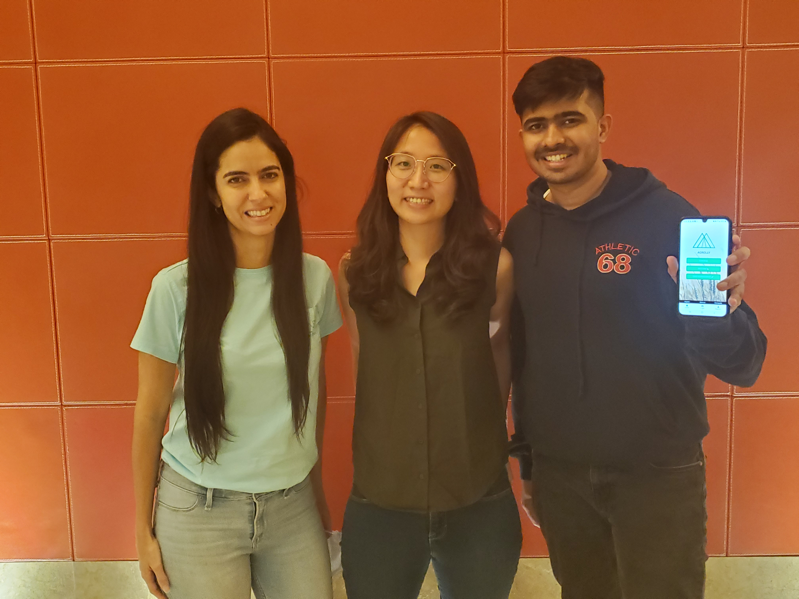

# OpenTempus

 

Welcome to OpenTempus, the open source technology used by Agrolly.

[Agrolly LLC](https://prometeoplatform.com/) created its solution as a [Call for Code submission](https://developer.ibm.com/callforcode/solutions/agrolly/) that won the top prize in the Global Challenge. In 2022, **_OpenTempus_** was contributed to the Linux Foundation as the open source core of Agrolly in order share the technology and provide a way for others to improve it for the benefit of all.

[The OpenTempus mission](OpenTempus-Technical-Charter-April-2022.pdf) is to provide long-term (annual) weather forecast for temperature and rainfall in order to help smallholder farmers make better decisions about what to plant and when. Weather forecasts (temperature and rainfall) are the base input for many agriculture developments and are difficult to forecast reliably.

The scope of the Project includes data science tools that can be used and improved to improve forecasts. This includes capabilities to: Increase scalability by getting historical data more efficient; Improve accuracy by analyzing different types of regression analysis;  and include other weather forecast parameters based on the community needs.

## Get started

- [Get started](#get-started)
- [OpenTempus and Agrolly](#opentempus-and-agrolly)
- [The story](#the-story)
- [Technical Steering Committee](#technical-steering-committee)
- [Public meetings](#public-meetings)
- [License](#license)

## OpenTempus and Agrolly

The core long-term forecasting capabilities of the Agrolly solution have been open sourced as OpenTempus, which is a complete solution on its own. You can learn more about [Agrolly its history on the Call for Code website](https://developer.ibm.com/callforcode/solutions/agrolly/).

### The OpenTempus name

The Name chosen for the open soruce solution is OpenTempus. The word "Open" comes from Open-source solutions and the word "Tempus" is a Latin word for Climate. Besides, “Open Tempus” means clear sky, with no extreme weather parameters, which for agriculture purposes is good. Agrolly wants to provide a clear vision of the forecasts upfront to fight climate change and improve productivity.

## The story

Watch this video to learn about the OpenTempus solution based on Agrolly's original Call for Code 2020 winning application:

## Technical Steering Committee

Per the [The OpenTempus Technical Charter](OpenTempus-Technical-Charter-March-2022.pdf)

| Name                     | Organization |
| ------------------------ | ------------ |
| Chimegsaikhan Munkhbayar | Agrolly LLC  |
| Ajinkya Datalkar         | Agrolly LLC  |
| Manoela Morais           | Agrolly LLC  |
| Helen Tsai               | Agrolly LLC  |
| Daniel Krook             | IBM          |
| Gaurav Ramakrishna       | IBM          |

## Public meetings

Thursdays at 10am US ET. [Join us on Webex](https://ibm.webex.com/ibm/j.php?MTID=m5743406c4328d840261b34ce5aeb0bf6).

### Minutes

- [Notes in the wiki](https://github.com/krook/OpenTempus/wiki)

## License

This project is licensed under the Apache 2 License - see the [LICENSE](https://github.com/Pyrrha-Platform/Pyrrha/blob/main/LICENSE) file for details.
